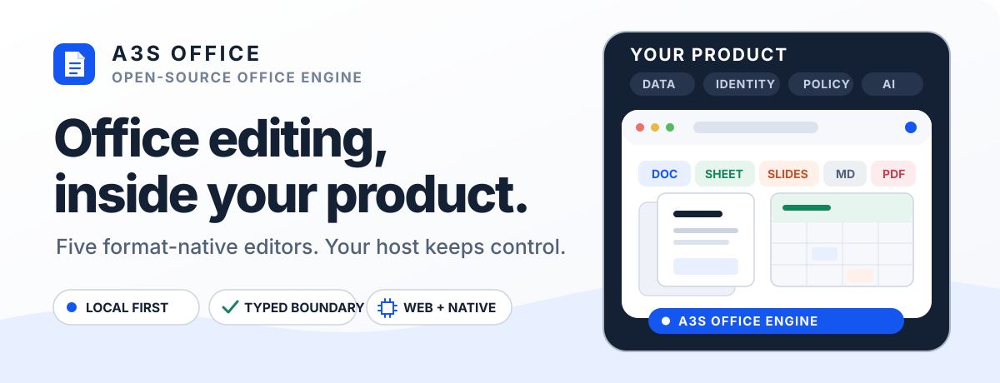
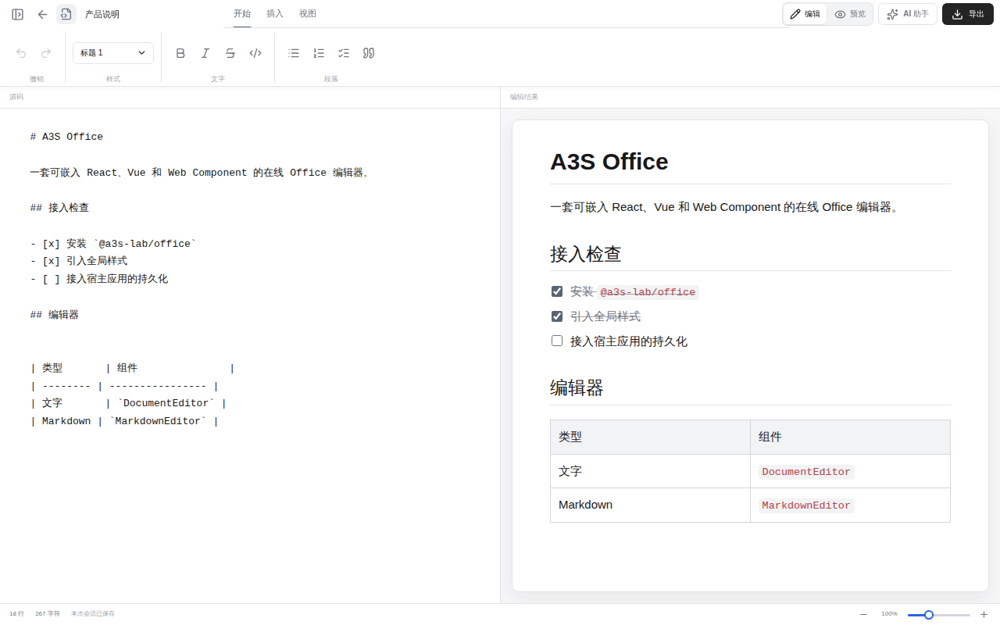
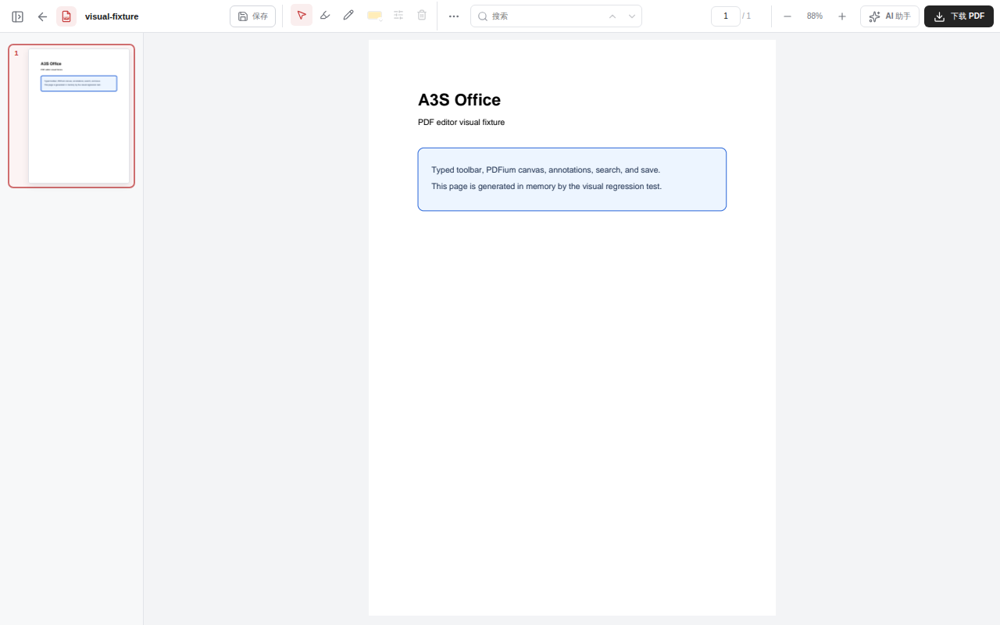
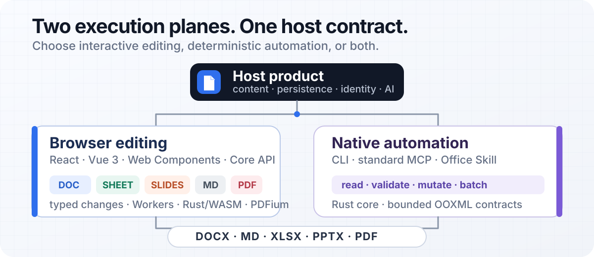

<p align="center">
  
</p>

<p align="center">
  <strong>AI-native Office surfaces for the browser, backed by deterministic native automation.</strong>
</p>

<p align="center">
  Edit documents, Markdown, spreadsheets, presentations, and PDFs inside your product.<br>
  Keep persistence, identity, collaboration, authorization, and AI in your host application.
</p>

<p align="center">
  <a href="https://github.com/A3S-Lab/Office/actions/workflows/ci.yml"></a>
  <a href="https://a3s-lab.github.io/Office/"></a>
  <a href="#project-status"></a>
  <a href="LICENSE"></a>
</p>

<p align="center">
  <a href="https://a3s-lab.github.io/Office/">Playground</a> ·
  <a href="https://a3s-lab.github.io/Office/docs/">Documentation</a> ·
  <a href="#quick-start">Quick start</a> ·
  <a href="#editor-capability-comparison">Editors</a> ·
  <a href="#real-time-collaboration">Collaboration</a> ·
  <a href="#native-automation">Automation</a> ·
  <a href="#architecture">Architecture</a> ·
  <a href="ROADMAP.md">Capability roadmap</a> ·
  <a href="COLLABORATION_ROADMAP.md">Collaboration roadmap</a> ·
  <a href="CONTRIBUTING.md">Contributing</a>
</p>

---

A3S Office is an open-source Office engine for product teams that need rich
browser editing and agent-ready file automation without adopting an A3S
backend. It ships complete editor surfaces, typed host contracts, browser file
workflows, and a separate Rust automation plane.

- **Embed complete editors** through React, Vue 3, Web Components, or the
  framework-neutral Core API.
- **Keep format-native behavior** instead of forcing every file through one
  lowest-common-denominator model.
- **Own the product boundary**: your application controls content, storage,
  permissions, collaboration, and model providers.
- **Collaborate across every editor** with shared Yjs/Yrs content, Awareness
  participants and remote locations, plus browser, CLI, MCP, and A3S Code peers.
  Document reviewers can submit attributed insertions, deletions, and
  replacements without directly changing canonical text. Editors can also
  track character- and paragraph-formatting revisions, accept the new
  formatting or restore the exact prior marks/properties, and retain either
  result in the immutable shared decision audit.
- **Automate deterministically** through the native CLI, standard MCP server,
  or packaged Office Skill.

## See it working

The images below are committed visual-regression baselines from the real
[Playground](https://a3s-lab.github.io/Office/), not conceptual mockups.

<p align="center">
  <a href="visual-tests/__snapshots__/linux/desktop-1280/document.png">
    
  </a>
</p>

<table>
  <tr>
    <td width="50%" valign="top">
      <a href="visual-tests/__snapshots__/linux/desktop-1280/spreadsheet.png">
        
      </a>
      <br><sub><strong>Spreadsheet</strong> — workbook editing and formula workflows</sub>
    </td>
    <td width="50%" valign="top">
      <a href="visual-tests/__snapshots__/linux/desktop-1280/presentation.png">
        
      </a>
      <br><sub><strong>Presentation</strong> — structured slides, objects, and presenter flows</sub>
    </td>
  </tr>
  <tr>
    <td width="50%" valign="top">
      <a href="visual-tests/__snapshots__/linux/desktop-1280/markdown.png">
        
      </a>
      <br><sub><strong>Markdown</strong> — GFM source and synchronized preview</sub>
    </td>
    <td width="50%" valign="top">
      <a href="visual-tests/__snapshots__/linux/desktop-1280/pdf.png">
        
      </a>
      <br><sub><strong>PDF</strong> — PDFium rendering, forms, annotations, Yjs overlays, and save</sub>
    </td>
  </tr>
</table>

## Editor capability comparison

The tables below compare capability families, not button counts or visual
similarity. **Supported** means the editable path has deterministic tests or
native round-trip evidence. **Partial** means a useful path exists with a
documented fidelity boundary. **Gap** means no product-grade editable path
exists yet. Traditional Office availability varies by application, platform,
edition, and subscription; its column describes the conventional suite
baseline rather than one specific release.

### Document

| Capability | A3S Office today | Traditional Office baseline |
| --- | --- | --- |
| Text, paragraphs, lists, and styles | **Supported** — structured editing, formatting, clipboard, format painter, and undo/redo | Mature authoring with a broader long-tail style catalog |
| Page layout and rendering | **Partial** — sections, margins, page size, columns, headers/footers, fields, and live pagination | Desktop-grade pagination, print layout, and vector output |
| Tables, pictures, and equations | **Partial** — rich table geometry, floating pictures, crop/wrap, and structured OMML | Broader drawings, text boxes, charts, WordArt, and SmartArt |
| Comments, revisions, and collaboration | **Partial** — comments, suggestions, text/format revisions, decisions, Yjs presence, and host relay contracts | Full revision families plus integrated sharing and review services |
| References and document generation | **Partial** — bookmarks, links, captions, cross-references, citations, notes, and common fields | TOC/index authoring, mail merge, compare/combine, and broader fields |
| Ribbon and shortcuts | **Supported** — responsive Office-style ribbon and editor-scoped daily-writing shortcuts | Complete desktop shortcut and contextual-tool surface |
| Very large documents | **Supported with boundaries** — bounded 100,000-block plain-document windows and measured edit/navigation budgets | Native-engine virtualization with device-dependent limits |
| DOCX and PDF fidelity | **Partial** — source-aware DOCX preservation and live-layout raster PDF export | Broader legacy/OOXML compatibility and searchable vector PDF output |

### Spreadsheet

| Capability | A3S Office today | Traditional Office baseline |
| --- | --- | --- |
| Cells, sheets, navigation, and history | **Supported** — multiple sheets, sparse editing, search, clipboard, four-direction fill, exact formula/value copy from above, and undo/redo | Mature grid workflows across desktop and web |
| Formatting and style rendering | **Partial** — native fonts, colors, borders, alignment, number formats, cell styles, all 17 native non-solid OOXML pattern fills, native linear/path XLSX gradients, and one Format Cells surface that authors none, solid, pattern, or gradient fills with exact geometry and 2–256 ordered stops; static date/time entry, contrast-safe font preview, native XLSX rich-text runs, selected-text font formatting, direct formula-bar/F2 insertion or deletion, and bounded authenticated formatted-HTML paste | Disjoint multi-edit rich-text authoring, broader themes, locale formats, and advanced style effects |
| Ribbon and shortcuts | **Partial** — common Office-style Home/Data/View commands, grid-scoped shortcuts, and focused Font-dialog aliases | Larger command catalog and platform-specific accelerators |
| Formulas and recalculation | **Partial** — dependency-aware calculation and common formula paths | Wider functions, arrays, volatile semantics, and calculation parity |
| Tables, pivots, charts, and rules | **Partial** — native tables, pivots, charts, conditional formatting, and validation | Calculated columns, slicers, pivot charts, advanced rules, and analysis |
| Large worksheets | **Supported with boundaries** — maximum-dimension sparse import/editing and viewport-bounded Canvas painting | Highly optimized native grid with hardware-dependent limits |
| Files and printing | **Partial** — XLS/XLSX/ODS/CSV import, XLSX export, and PDF output | Broader round trips, external data, print fidelity, and legacy conversion |
| External data, macros, and specialist analysis | **Gap** — active macros are never executed; bounded models are still needed for data connections and solver-like tools | Established data, macro/add-in, scenario, and optimization ecosystems |

### Presentation

| Capability | A3S Office today | Traditional Office baseline |
| --- | --- | --- |
| Slide and object editing | **Supported** — slide lifecycle, scene editing, multi-selection, grouping, transforms, and guides | Mature slide and drawing workflows |
| Text, shapes, tables, charts, and images | **Partial** — typed editable objects with native import/export paths | Broader shapes, connectors, effects, SmartArt, and embedded chart editing |
| Masters and layouts | **Partial** — import/export inheritance with editable common paths | Full visual master, layout, and placeholder authoring |
| Transitions and timings | **Partial** — fade, push, wipe, split, cut, and click/automatic advance | Broader transition catalog and timing controls |
| Animations and media | **Gap** — no production animation timeline, trigger model, audio, video, or recording path | Object animation, motion paths, media editing, and recording |
| Slideshow and presenter workflows | **Supported** — current/beginning start, keyboard playback, notes, timer, and responsive presenter view | Rehearsal, recording, ink/laser, and richer multi-display controls |
| Review and collaboration | **Partial** — comments, shared presence, remote object locations, and host transport | Threads, assignments, mentions, and integrated cloud review |
| PPTX, print, PDF, and video | **Partial** — PPTX round trip plus slide/notes/handout PDF models; no video export | Broader print controls, vector fidelity, media preservation, and video export |

### PDF

| Capability | A3S Office today | Traditional Office baseline |
| --- | --- | --- |
| Rendering and navigation | **Supported** — PDFium pages, thumbnails, zoom, keyboard navigation, and bounded long-file windows | Mature desktop/web viewing and navigation |
| Search and text evidence | **Supported with boundaries** — browser search and bounded native text-layer evidence | Broader tagged-PDF reading order and accessibility extraction |
| Annotations, forms, and save | **Supported** — common annotations, appearance controls, form filling, history, and save | Broader stamps, measurements, form authoring, scripts, and signatures |
| Existing text, image, and object editing | **Gap** — no safe production content-stream editing path | Direct text/object editing with font and layout recovery |
| Page organization | **Gap** — insert, delete, rotate, reorder, extract, merge, and split are not yet editable | Complete page organization workflows |
| Compression, conversion, and OCR | **Gap / host boundary** — provider contracts are required for authoritative conversion and OCR | Integrated optimization, conversion, and scanned-document recognition |
| Signatures, protection, and redaction | **Gap / host boundary** — trusted identity and destructive-content guarantees are required | E-signing, certificate validation, encryption, sanitization, and true redaction |
| AI and real-time collaboration | **Host-owned** — typed page/text evidence, Yjs review records, presence, and provider-neutral ports | Typically bundled with account, storage, and model services |

### Markdown

Markdown is an A3S Office differentiator rather than a parity target.

| Capability | A3S Office today | Traditional Office baseline |
| --- | --- | --- |
| Source and visual editing | **Supported** — GFM source, visual mode, synchronized split preview, and source-native history | No standard first-class Markdown editor |
| Tables, tasks, links, images, and code | **Supported** — format-native Markdown structures in both editing modes | Usually represented through rich-document conversion or plain text |
| Responsive UI and shortcuts | **Supported** — desktop split view, phone single-surface modes, and editor-scoped formatting | Depends on a text editor, add-in, or conversion workflow |
| Collaboration | **Supported** — Yjs content, Awareness presence, remote selections, and host-owned transport | Usually available only after conversion into a cloud document format |
| Import, export, and automation | **Supported** — direct Markdown round trip plus typed browser, CLI, MCP, and agent mutations | No shared native Markdown automation contract |

Document and Markdown accept public TipTap Extensions. Spreadsheet,
Presentation, and PDF expose stable host ports rather than private command
contexts. Editor engines and large runtime assets load only when their surface
is requested. The complete gap inventory and exit evidence live in the
[capability roadmap](ROADMAP.md).

## Why A3S Office

- **Product-native UI** — Complete Office-style surfaces with no required
  backend, account system, or storage model.
- **Accessible responsive shell** — Compact sidebars, slide navigation, AI
  panes, responsive chart inspectors, dialogs, menus, and popovers share
  bounded keyboard navigation, background isolation, topmost Escape handling,
  and focus restoration.
  Persistent desktop navigation and the temporary phone drawer keep separate
  open states, so live breakpoint changes never turn a desktop sidebar into an
  unexpected blocking modal or steal focus from the workspace.
  Shared color palettes expand to an eight-column touch layout on phones while
  preserving spatial arrow-key navigation.
  Shared Office selects use 44 px phone option rows and bounded internal
  scrolling while retaining keyboard selection and exact focus restoration.
- **Editor-scoped zoom** — Status controls and Ctrl/Cmd + mouse-wheel gestures
  share each surface's bounded zoom model without changing the host browser's
  page scale.
- **Predictable state** — Controlled content values, typed callbacks, explicit
  file actions, conflict-aware document edits, and one document typography
  baseline across editing, preview, and PDF rendering. Word editing and
  read-only preview retain the same canonical TipTap tree, while browser PDF
  export captures that same Worker/WASM page layout instead of rebuilding
  content from compatibility HTML. Caption numbering and cross-reference
  validity also update in that same transaction graph, including a truthful
  missing-target state after deletion. Paired Word bookmarks can span blocks,
  retain stable native identities through edits, drive live editable REF
  fields, and keep internal links distinct from external hyperlink
  relationships; deleting a target exposes truthful missing-link and
  missing-reference states that undo repairs. Footnote and endnote references
  remain paired with one editable definition, renumber live in independent
  reference-order sequences, receive new identities when copied, and are
  deleted or restored together through one undoable transaction. Body `PAGE`,
  `NUMPAGES`, `SECTION`, `SECTIONPAGES`, `DATE`, and `TIME` fields are atomic,
  copied under fresh stable identities, and resolve from the live Worker/WASM
  page containing each field. Automatic reflow updates numeric fields without
  adding history or ticking clock fields; F9 refreshes every field in one
  undoable action. Safe inline DOCX fields round-trip natively, while nested,
  incomplete, cross-paragraph, deleted, or instructionless structures stay
  text and produce an explicit compatibility warning.
- **Framework choice** — React components, Vue 3 adapters, Custom Elements,
  and a framework-neutral Core API over the same engine.
- **Responsive computation** — Lazy editor chunks, cancellable Workers,
  streamed dense XLSX and eligible large-DOCX parsing in dedicated
  transferable-input Workers, including a fail-closed plain-OOXML path that
  reuses the package Worker's decompressed worksheet XML and aborts speculative
  SheetJS parsing only after package authentication,
  CSS-compatible font-weight matching, Rust WebAssembly layout and
  calculation, and PDFium rendering. Spreadsheet Canvas painting is bounded
  to the visible row and column range. Eligible structurally plain large DOCX
  files retain one complete canonical structured model while TipTap initially
  materializes only two equal-position chunks and hydrates a selected chunk on
  demand. The large-DOCX Worker streams 2,048-item batches and columnar table
  metadata instead of cloning one complete object graph. Pooled semantic
  previews, physical page sheets, and pagination widgets are windowed
  independently. The PDF rail mounts at most 32 thumbnail buttons, aborts the
  exact PDFium task when a thumbnail leaves the window, and uses instant
  long-distance keyboard jumps so the destination retains focus. The checked
  1,000-page fixture mounts 15 thumbnails and seven main-view pages at
  readiness. Presentation decks above 60 slides use independent thumbnail-node
  and scene windows. The checked 1,000-slide, 9,000-element fixture mounts 18
  thumbnail buttons and 13 full thumbnail scenes, retains about 10.9 MiB of
  JavaScript heap, reaches slide 1,000 in 6.1–13.4 ms, and produces no Long
  Tasks. Design metadata is normalized once per controlled value and each
  visible thumbnail resolves only its own slide. The checked 100,000-block
  fixtures keep
  selection, editing, and export positions in the canonical model instead of
  replacing them with a React-only virtual list; rich and collaborative models
  deliberately retain the complete compatibility path. Consecutive controlled
  edits hash only changed lazy chunks and combine cached fingerprint segments,
  while cloned or persisted models still receive complete HTML verification.
- **AI without UI scraping** — Typed agent ports and host-defined selection
  actions receive structured context and editing commands.
- **Automation outside the browser** — The native Rust CLI, standard MCP
  server, and Office Skill share bounded mutation contracts. Coding agents can
  also keep a durable Yrs replica, exchange standard Yjs v1 updates and state
  vectors, perform authorized typed Markdown, Document, Spreadsheet cell/batch,
  Presentation scene-element and z-order, and PDF annotation, form-value, and
  review changes, including attributable Document selection comments, replies,
  text suggestions, and atomic final decisions, retain browser/native actor
  attribution, validate browser-created character- and paragraph-formatting
  revisions and their audit records, and checkpoint without replacing a whole
  Office file.

## Real-time collaboration

Document, Markdown, Spreadsheet, Presentation, and PDF expose the same
transport-neutral collaboration boundary. Two browser clients can edit one
artifact live, render an accessible participant roster, and project remote
text selections, cells, scene objects, pages, or annotations without moving
the local user's viewport or focus. Native Yrs replicas join the same state
through the CLI, standard MCP server, or A3S Code.

The host owns rooms, authentication, authorization, network delivery, offline
buffering, persistence, and the `Y.Doc`; A3S Office owns format-specific
bindings, local undo, validated presence, and conflict-local typed mutations.
Spreadsheet table state uses ordered, ID-keyed records with creation claims;
independent table name, style, stripe, column, and filter fields can converge
without replacing a serialized worksheet.
An authenticated Document `comment` session can select text, create a durable
thread, reply, resolve or reopen it, and delete only review records owned by
its actor while canonical content remains read-only. The server independently
validates that review-only boundary before persistence and broadcast. An
authenticated Document `suggest` session can submit attributed insertions,
deletions, and replacements while canonical text, structure, formatting,
options, comments, and other actors' suggestions remain protected. An `edit`
participant accepts or rejects a proposal and appends the final actor-attributed
decision to the immutable `document.change-decisions` audit trail. The A3S Boot
service also persists `edit`-mode character- and paragraph-formatting revisions
and validates their bounded prior-format snapshots before broadcast. Character
decisions keep or restore direct marks. Paragraph decisions keep or restore
alignment, direction, indentation, spacing, pagination, outline, tab stops,
borders, shading, and collapsed state without deleting text. Authenticated
`suggest` updates must preserve both revision kinds and cannot rewrite their
identity or snapshot. `suggest` on non-Document formats remains receive-only.
See the bilingual [real-time collaboration guide](https://a3s-lab.github.io/Office/docs/components/collaboration.html)
for React, Vue, Web Component, reconnect, security, and native-agent setup.
The repository also ships a runnable
[A3S Boot collaboration server](examples/collaboration-server/) with signed
room tickets, Origin validation, durable Yrs storage, Awareness relay, a typed
browser adapter, and actor-scoped browser or native room messages.

## Quick start

### Try the product locally

Node.js 20+, Bun 1.3+, and Rust 1.85+ are required.

```bash
git clone https://github.com/A3S-Lab/Office.git
cd Office
bun install --frozen-lockfile
bun run playground
```

Then open the local URL printed by the development server. For a zero-install
tour, use the [live Playground](https://a3s-lab.github.io/Office/).
Choose **体验格式修订**, open **审阅**, then **查看修订（2）** to inspect the
independent Formatting and Paragraph Formatting cards and exercise accept or
reject semantics.

### Embed a controlled React editor

Install the public package with its React peers:

```bash
bun add @a3s-lab/office react react-dom
```

Import the stylesheet once, give the editor an explicit-height host, and store
the complete value emitted by `onChange`:

```tsx
import { useState } from 'react';
import type { DocumentContent } from '@a3s-lab/office/core';
import { DocumentEditor } from '@a3s-lab/office/react';
import '@a3s-lab/office/styles.css';

const initialContent: DocumentContent = {
  type: 'document',
  html: '<h1>Project brief</h1><p>Start editing here.</p>',
  pageSize: 'a4',
  pageColor: '#ffffff',
};

export function ProjectBrief() {
  const [content, setContent] = useState(initialContent);

  return (
    <main style={{ height: '100dvh', minHeight: 0 }}>
      <DocumentEditor
        content={content}
        onChange={setContent}
        theme="system"
      />
    </main>
  );
}
```

The editor owns editing, layout, import/export, and browser rendering. The host
owns persistence and decides when, where, and how the emitted content is saved.

### Preload an anticipated PDF

Editor modules remain lazy. PDFium runtime loading is a separate, explicit
choice because its unpacked WebAssembly binary is about 4.4 MiB. Warm both only
from a high-confidence intent, and use the same URL when mounting `PdfViewer`:

```tsx
import { PdfViewer, preloadOfficeEditor } from '@a3s-lab/office/react';

const pdfiumUrl = '/assets/pdfium.wasm';

void preloadOfficeEditor('pdf', {
  pdfWasmUrl: pdfiumUrl,
  preloadRuntimeAssets: true,
});

<PdfViewer loadSource={loadPdf} wasmUrl={pdfiumUrl} />;
```

The preload caches the module and, when the request succeeds, the response
body. Runtime warming is best effort: a network failure does not block editor
opening, and a later call retries it. The helper does not create a hidden
viewer or pre-initialize the PDFium Worker. On the local reference machine it
improved median shell mount by 41.6 ms but did not improve the viewer-ready
median, so Worker initialization remains the measured boundary.

### Persist a structured document snapshot

Hosts that round-trip controlled document values across a process or language
boundary should use the public versioned snapshot codec instead of converting
the editor value to Markdown or treating HTML as the complete document:

```ts
import {
  decodeDocumentSnapshot,
  encodeDocumentSnapshot,
} from '@a3s-lab/office/core';

const encoded = encodeDocumentSnapshot(content);
await storage.put(documentId, encoded);

const restored = decodeDocumentSnapshot(await storage.get(documentId));
```

The v1 envelope uses the
`application/vnd.a3s.office.document-snapshot+json;version=1` media type. It
retains the synchronized HTML, structured ProseMirror model, page layout,
comments, review state, and bibliography as deterministic bounded JSON. Decode
fails closed for a different schema or version, malformed JSON, an oversized
payload, or a model whose HTML fingerprint is stale. Optional `undefined`
properties are omitted because they are outside the JSON data model.

### Export the live Word layout to PDF

Give each mounted document a stable `artifactId`, then pass the matching,
current artifact to `downloadArtifactPdf`. Export waits for the live pagination
surface and crops the physical pages computed by the editor:

```tsx
import { useState } from 'react';
import {
  createArtifact,
  downloadArtifactPdf,
} from '@a3s-lab/office/core';
import { DocumentEditor } from '@a3s-lab/office/react';

export function DocumentWithPdfExport() {
  const [artifact, setArtifact] = useState(() =>
    createArtifact('blank-document'),
  );

  if (artifact.content.type !== 'document') return null;

  return (
    <main style={{ display: 'flex', height: '100dvh', flexDirection: 'column' }}>
      <button
        type="button"
        onClick={() => void downloadArtifactPdf(artifact)}
      >
        Export PDF
      </button>
      <section style={{ flex: 1, minHeight: 0 }}>
        <DocumentEditor
          artifactId={artifact.id}
          content={artifact.content}
          onChange={(content) =>
            setArtifact((current) => ({
              ...current,
              content,
              revision: current.revision + 1,
              updatedAt: Date.now(),
            }))
          }
        />
      </section>
    </main>
  );
}
```

The live path preserves automatic page-break decorations, shaped text, table
continuations, and page chrome. It currently rasterizes each physical page
into the PDF; searchable text and vector output remain future fidelity work.

### Choose an entry point

- `@a3s-lab/office/react` — Lazy React editor components and preload helpers.
- `@a3s-lab/office/vue` — Vue 3 adapters with `v-model:content`.
- `@a3s-lab/office/web-component` — Custom Elements for framework-agnostic UI
  composition.
- `@a3s-lab/office/core` — Typed models, templates, import, export, and browser
  file workflows, plus transport-neutral Yjs bindings for Markdown, Document,
  Spreadsheet, Presentation, and PDF collaboration.
- `@a3s-lab/office/styles.css` — Shared editor and interaction-system styles.

Copyable React, Vue, and Web Component examples live in the
[component documentation](https://a3s-lab.github.io/Office/docs/components/).

## Controlled by design

A3S Office is headless at the product boundary, not at the UI boundary. The
package includes complete toolbars, ribbons, panes, popovers, and dialogs while
leaving product infrastructure to the host.

**A3S Office owns:** editing models and commands; import, export, layout, and
rendering; editor UI and responsive interactions; typed selection and agent
ports.

**Your host owns:** persistence and version history; identity, permissions,
and collaboration; the application shell and navigation; AI providers,
prompts, policy, and request lifecycle.

For collaborative surfaces, pass the host-owned typed Presence controller as
`presence` beside its exact `collaboration` session. Every editor projects the
same responsive participant roster across editing and preview chrome, including
human/agent identity, mode, activity, and a format-specific location summary.
Editors publish their local location and project remote locations without
writing them into canonical content: Document and Markdown render text
selections/carets, Spreadsheet uses Fortune Sheet's native cell-presence layer,
Presentation frames stable object IDs, and PDF identifies peers on the current
page or annotation. A remote roster row explicitly navigates and focuses that
location; passive Awareness updates never move the local selection, viewport,
or focus. The host continues to synchronize Awareness and own both lifecycles.

Document and Markdown selection menus can be replaced with host-defined typed
actions. Each action receives an immutable selection snapshot, nearby text,
the complete controlled content, and conflict-aware `replaceText`,
`insertBefore`, `insertAfter`, and `copyText` commands. Markdown snapshots also
identify whether the source or visual surface owns the selection. Async edits
track unrelated visual-editor transactions and fail with `stale-selection`
instead of changing the wrong text. The Playground's open-ended question action
enters a focused draft before dispatch, so a host never receives an unfinished
“Question:” request; attached context stays available without dominating the
assistant surface.

## Browser file workflows

The Core API creates typed blank artifacts and performs browser-side import or
export without mounting an editor:

```ts
import {
  createArtifact,
  createArtifactBlob,
  importOfficeFile,
} from '@a3s-lab/office/core';

const controller = new AbortController();
const shell = createArtifact('blank-document');
const imported = await importOfficeFile(file, {
  artifactId: shell.id,
  signal: controller.signal,
  onProgress: ({ stage, progress }) => {
    console.info(stage, `${Math.round(progress * 100)}%`);
  },
});
const output = await createArtifactBlob(imported);
const blankDeck = createArtifact('blank-presentation');

const workbookShell = createArtifact('blank-spreadsheet');
if (workbookShell.content.type !== 'spreadsheet') {
  throw new Error('Expected a Spreadsheet shell.');
}
const workbook = await importOfficeFile(spreadsheetFile, {
  artifactId: workbookShell.id,
  spreadsheetSheetIds: workbookShell.content.sheets.flatMap((sheet) =>
    sheet.id ? [sheet.id] : [],
  ),
});
```

Import progress advances monotonically through `reading`, `parsing`,
`analyzing`, and `finalizing`. Calling `controller.abort()` rejects with an
`AbortError`; large reads and parser checkpoints yield so a host can keep the
progress and Cancel controls responsive. An optional host-reserved
`artifactId` lets the UI mount an editor shell before parsing finishes and then
apply the imported controlled value without remounting that surface. The
Playground uses this boundary to overlap DOCX Worker parsing with editor
initialization; source-backed export remains attached to the reserved ID. A
Spreadsheet host can also reserve worksheet identities with
`spreadsheetSheetIds`. Eligible structurally plain workbooks then replace the
authenticated frozen matrix inside the mounted Fortune instance instead of
cloning one million cells through a second mount. Sheet-count or identity
changes, preview mode, charts, protection, merged or styled geometry, and other
stateful workbook structures retain the complete remount path. The plain-OOXML
Worker authenticates row and cell coordinates directly in its XML buffer, so a
million-cell import does not allocate or regex-match a million address strings.

Spreadsheet import and export preserve sparse worksheets up to the XLSX limit
of 1,048,576 rows by 16,384 columns. The logical `data.length`, `row`, and
`column` dimensions can be large while only populated indexes are materialized.
Virtual scrolling never emits `onChange`, and editing a far blank row creates
only that row. Data-validation regions remain compact in
`dataValidationRanges`; direct `dataVerification` entries take precedence.
Protection ranges, passwordless editable ranges, and conditional formatting
also remain compact and round-trip through native XLSX records without
allocating every covered cell.

Native XLSX pattern fills retain all 17 non-solid OOXML pattern identities plus
their foreground and background RGB, theme, indexed, automatic, and tint color
origins. Canvas draws them only for visible cells, behind text and below table
or conditional-format fills. Format Painter, Paste Special Formats, unrelated
formatting, Yjs collaboration, export, and reopen preserve the metadata; a new
solid fill, No Fill, Clear Formats, or built-in Cell Style intentionally clears
it. Malformed patterns fail closed, and semantic palette conflicts export
literal RGB instead of a false theme or indexed reference.

Format Cells now authors every native pattern through one typed fill model.
Users can switch between none, solid, all 17 pattern types, and gradients while
retaining inactive drafts, preview the exact Canvas result, and edit pattern
foreground/background colors. Apply publishes one controlled workbook update
and one Undo record; export and reopen retain the authored native pattern.

Native XLSX gradient fills retain linear angles, path inner-rectangle geometry,
two through 256 ordered stops, and each stop's RGB, theme, indexed, automatic,
or tint identity. Fortune projects the first stop into `bg`; metadata remains
active only while that projection matches. Visible linear fills use Canvas
gradients, while path fills use at most 96 clipped rectangular contours, so
off-viewport cells do no work and rendering stays bounded. Format Painter,
Paste Special Formats, unrelated edits, Yjs collaboration, export, and reopen
preserve the fill. Explicit fills and format resets clear it, malformed input
fails closed, and semantic palette conflicts fall back to literal RGB.

The same Format Cells Fill tab authors linear or path gradients without a
second style state. It exposes exact angle or inner-rectangle geometry, 2–256
ordered stops, midpoint insertion with interpolated color, stop removal and
editing, mixed-selection safeguards, and a live native Canvas preview. Invalid
stop order or path geometry blocks Apply before mutation; an accepted Apply
remains one controlled update and one Undo record.

Worksheet Tables/ListObjects live in `sheet.tables` as semantic records with
stable IDs, workbook-unique names, zero-based ranges, ordered columns, filters,
header/totals flags, and built-in style identity. XLSX import and export keep
native table parts and relationships. Table styling is resolved only for the
visible Canvas cells; converting a table to a range materializes the confirmed
appearance without densifying unrelated worksheet space. Structured-reference
calculation, calculated columns, complete totals authoring, slicers, and
external/query tables are not yet claimed.

Use `downloadArtifact` to start a browser download or
`createArtifactBlob` when your application owns upload and persistence.
Imported DOCX artifacts are source-backed: safe source-only OPC parts,
content-type registrations, and relationships survive a regenerated export.
Persist the original Blob alongside the artifact and call `registerSourceBlob`
after a browser reload. If that source is unavailable, DOCX export fails
explicitly instead of silently dropping complex package state. The artifact's
source metadata carries a SHA-256 fingerprint, so registering a different DOCX
under the same artifact ID also fails. Generated core parts remain
authoritative; compatibility diagnostics identify known inline OOXML
normalization and the deliberate removal of invalid signatures, VBA, ActiveX,
and custom-ribbon parts. Within `word/settings.xml`, relationship-free
ignorable attributes, elements, and structurally valid, non-conflicting
`mc:AlternateContent` blocks survive strict or transitional UTF-8/UTF-16
sources. Generated Word settings still win, and this preservation does not yet
restore behavior-changing settings. Regenerated `word/styles.xml` and
`word/numbering.xml` also retain relationship-free passive extensions at the
root and on uniquely matched identities. Styles match by type plus style ID;
imported abstract-numbering, concrete-numbering, and level metadata follows
regenerated IDs. Source-only or duplicate identities, malformed trees,
relationship-bound content, and ambiguous one-to-many numbering mappings are
dropped. Generated Word style and numbering semantics still win. In regenerated
document, header, footer, footnote, and endnote parts, relationship-free passive
extensions from non-OOXML ignorable namespaces also follow uniquely matched
picture drawings, using normalized anchor and drawing-property IDs. Body,
header, footer, footnote, and endnote imports retain those image identities in
sanitized editable HTML. Passive extensions also follow uniquely matched,
unchanged paragraphs and their paragraph properties by native `w14:paraId`
plus `w14:textId`. Body and page-chrome HTML
retain these identities; text edits rotate `textId`, formatting-only edits and
moves keep it, and copies or splits receive new paragraph IDs. Source-only,
duplicate, changed-text, relationship-bound, Microsoft/OOXML semantic, and
ambiguous branches are dropped; generated paragraph and drawing semantics stay
authoritative. Office 2013 `w15:collapsed` paragraph metadata also round-trips
through body and page-chrome HTML as `data-office-default-collapsed`. Import
accepts only an empty leaf or the exact core Word `w:val` lexicals `true`,
`on`, `1`, `false`, `off`, and `0`; an omitted value means true, while a
malformed or duplicated direct value fails closed instead of inheriting stale
state. Export canonicalizes explicit states to `1` or `0`, declares the Word
2012 namespace, and adds its prefix to `mc:Ignorable`. This metadata remains
native-only: browser content stays expanded and editable, without conflating
Word's initial collapsed-heading view with navigation-pane state or hidden
text. Stable table hierarchies use native row `w14:paraId` plus
`w14:textId`, ordered directly owned row IDs for tables, and directly owned
paragraph IDs for cells. Passive extensions on `w:tbl`/`w:tblPr`,
`w:tr`/`w:trPr`, and `w:tc`/`w:tcPr` survive body or page-chrome regeneration.
Row text or structural edits rotate the row version; formatting-only edits and
moves retain it, copies receive independent IDs, and nested rows or cells are
isolated from their outer table. Duplicate or cross-kind identities and unsafe
extension branches fail closed, while generated table geometry and formatting
win. Imported footnotes and endnotes now retain their native positive `w:id`
across reorderings, while copies receive independent IDs. Signed native comment
and reply IDs, reply parentage, and resolved state also survive regeneration.
Native DrawingML pictures inside footnotes and endnotes retain their identity,
layout, wrapping, crop, and layer metadata through public import and artifact
export. Export repairs missing image relationships in generated note parts,
allocates collision-free relationship IDs, and validates each media payload.
Changed, duplicate, namespace-spoofed, relationship-bound, or semantic drawing
branches stay disconnected; generated geometry and media remain authoritative,
while legacy VML, shapes, and SmartArt normalize.

Supported native OMML equations now survive as bounded structured objects in
the document body, headers, footers, footnotes, and endnotes. Inline and display
math, Unicode runs with literal/normal-text semantics, math script/style,
manual-break, and alignment-point properties, common fractions, scripts,
left-side pre-sub/superscripts with empty script slots, radicals with optional
degrees, functions, n-ary operators, combining accents, overbars and underbars,
group characters with
explicit grouping-character placement and baseline justification, phantoms with
visible or hidden bases, independently zeroed width, ascent, or descent, and
transparent spacing, border boxes with independently visible edges and four
strike directions, semantic boxes with
operator-emulation, no-break, differential-spacing, manual-break, and alignment
properties, bounded rectangular matrices with explicit column alignment,
row-spacing and column-gap rules, and minimum column widths,
equation arrays with 1–64 rows, vertical base alignment, maximum/object
distribution, row-spacing rules, and `&` alignment/spacer markers, lower and
upper limit objects, and delimiters regenerate as `m:oMath` or `m:oMathPara` and
render an accessible MathML preview. Bar placement preserves the distinct OMML
defaults for an omitted `barPr` and an omitted `pos`. Group-character
normalization separately preserves an absent `chr` as U+23DF, an explicitly
empty `chr`, bottom `pos`, and the absent-versus-empty `vertJc` defaults.
Phantom normalization preserves the visible `show` default and disabled
`zeroWid`, `zeroAsc`, `zeroDesc`, and `transp` defaults; MathML preview uses
`mphantom` and `mpadded` without discarding the native spacing properties.
Pre-scripts preserve required `sub`, `sup`, and `e` ordering and map empty left
script slots to MathML `none` children after `mprescripts`.
Right-side `sSup`, `sSub`, and `sSubSup` objects enforce their property-first
argument order. `sSubSupPr` preserves `alnScr`, canonicalizes its absent or
disabled value to unaligned scripts, and retains the enabled state through
native export. Supported fraction, script, limit, radical, function, n-ary,
accent, bar, group-character, phantom, border-box, box, matrix,
equation-array, and delimiter property containers preserve one optional ordered
`m:ctrlPr` control format through the same bounded Word run-property model.
The control may contain a direct `w:rPr` or bounded tracked provenance rooted
at `w:ins`, `w:del`, `w:moveFrom`, or `w:moveTo`. Each revision retains a
non-negative 32-bit `w:id`, a bounded `w:author`, an optional validated
`w:date`, and optional Microsoft 365 `w16du:dateUtc` with a UTC `Z` suffix.
Word's legal `moveFrom/moveTo -> ins/del` and `ins -> del` chains are
preserved, with the optional `w:rPr` at the deepest level. Every supported
`deg`, `den`, `e`, `fName`, `lim`, `num`, `sub`, and `sup` argument slot
preserves the same direct or revision-wrapped control format after its
expressions. Empty `ctrlPr` or direct `w:rPr` values canonicalize away, while
an empty revision remains native provenance. Safe object-control values project
only onto separable MathML control/operator nodes; argument-slot formatting and
all revision provenance remain native metadata because professional MathML has
neither linear-build control characters nor Word review/move-range semantics.
Document-level move-range pairing is not inferred from an isolated equation.
Matrix properties follow the ordered
`baseJc -> plcHide -> rSpRule -> cGpRule -> rSp -> cSp -> cGp -> mcs -> ctrlPr`
grammar. Row and column rules accept single, 1.5, double, exact, and multiple
spacing. `rSp` and `cGp` are bounded to 65,535, while the minimum column width
`cSp` is bounded to 31,680 twips. If any spacing property is
present, omitted or attribute-free peers take their Word defaults and native
export emits a complete canonical spacing group. Row spacing and column gaps
project to MathML `rowspacing` and `columnspacing`; `cSp` remains native-only
for layout because MathML `columnwidth` is a fixed width rather than Word's
minimum.
Fractions enforce optional `fPr` before required `num` and `den` arguments.
An absent `type` or an attribute-free `type` canonicalizes to `bar`; `noBar`,
`skw`, and `lin` remain distinct through native export and MathML projection.
Radicals enforce `radPr`, optional `deg`, and `e` ordering. An omitted or empty
degree normalizes to a square root, while a visible nonempty degree remains an
nth root. Native export emits the canonical `radPr -> deg -> e` shape and uses
`degHide=1` with an empty degree slot for square roots.
Functions enforce optional `funcPr` before required `fName` and `e` slots. Both
required slots may be empty. Every supported `CT_OMathArg` slot may likewise be
empty and follows `argPr -> expressions -> ctrlPr`. Its optional trailing
`ctrlPr` retains one bounded direct or revision-wrapped Word control; fixed
slots use named metadata, while matrix cells, equation-array rows, and delimiter
arguments use strictly dimension-aligned metadata. Absent or empty
argument/control properties and
absent, empty, or zero `argSz` values normalize to the default. Bounded
`argSz` values from -2 through 2 round-trip as relative argument sizes. The
Word-effective `box/e`, `groupChr/e`, `limLow/lim`, `limUpp/lim`, `nary/sub`,
`nary/sup`, `rad/deg`, `sPre/sub`, `sPre/sup`, `sSub/sub`, `sSubSup/sub`,
`sSubSup/sup`, and `sSup/sup` pairs project to inverse-sign relative MathML
`scriptlevel`; valid sizes in other argument slots remain native metadata.
Out-of-range or malformed sizes, duplicate or misplaced properties, malformed
control-revision identities or nesting, and semantic argument properties fail
closed.
N-ary operators enforce optional `naryPr` before required `sub`, `sup`, and `e`
slots. An omitted `chr` defaults to U+222B, while an attribute-free `chr`
remains an explicitly empty unsupported operator; an attribute-free `limLoc`
defaults to `undOvr`. Omitted or disabled `grow` values normalize to the
non-growing default; an attribute-free or enabled `grow` round-trips and maps
to MathML `stretchy=true`. Native export always emits both limit slots with
`subHide` or `supHide` for absent scripts.
Delimiters require optional `dPr` before 1–32 `e` arguments and preserve empty
argument slots. Their properties follow
`begChr -> sepChr -> endChr -> grow -> shp -> ctrlPr`; omitted characters
normalize to `(`, U+2502, and `)`, while attribute-free character properties
remain explicitly empty. Omitted or enabled `grow` and omitted, attribute-free,
or `centered` shapes canonicalize to the growing centered defaults. Non-growing
and `match` shapes round-trip in schema order. MathML projects fixed delimiters
with `stretchy=false` and content-matched growing delimiters with
`symmetric=false`; Word ignores shape while delimiter growth is disabled.
Display equations preserve `left`, `right`, `center`, and `centerGroup`
paragraph justification. The bounded native grammar accepts one optional
`m:oMathParaPr` before one `m:oMath`, while absent properties, absent `m:jc`,
and an attribute-free `m:jc` all canonicalize to the `centerGroup` default.
Math-run properties preserve the ordered `lit`, `nor`, `scr`, `sty`, `brk`, and
`aln` grammar, canonicalize Roman/italic and disabled defaults, bound `alnAt` to
1–255, and project supported script/style combinations through MathML
`mathvariant` while retaining native break and alignment metadata.
Math runs also preserve the native `m:rPr -> w:rPr -> m:t/w:t` order. The
bounded Word run-property subset covers direct and theme font references,
Latin and complex-script bold/italic flags, all-caps and small-caps
presentation, strike and double-strike, outline, shadow, emboss, imprint,
proofing/grid flags, hidden and web-hidden states, direct and theme colors with
tint/shade, signed character
spacing through 31,680 twips, 1–600% horizontal scaling, half-point kerning
thresholds and signed baseline positions, half-point font sizes, colored
underline styles, all seven legacy text-animation values, all 27 line-border
styles with direct/theme colors, 2–96 eighth-point widths, 0–31 point spacing,
and explicit shadow/frame flags, all named highlight colors, complete patterned
run shading with direct or theme foreground/background colors, manual run
widths from 0 through 31,680 twips with optional signed 32-bit grouping IDs,
explicit baseline/superscript/subscript run alignment, all five Word
emphasis-mark values (`none`, `dot`, `comma`, `circle`, and `underDot`),
RTL/complex-script flags, Latin, East Asian, and bidi language tags, and East
Asian typography metadata with optional signed 32-bit run IDs, two-lines-in-one
flags, all five enclosing-bracket styles, horizontal-in-vertical rotation, and
rotated-text compression, plus explicit paragraph-mark always-hidden/reset
flags and Office 2010 text glow, shadow, reflection, text-outline, text-fill,
3D-scene, and 3D-property effects plus all 16 ligature combinations, all three
numeral forms, all three numeral-spacing modes, bounded lists of all 20
OpenType stylistic sets, and explicit contextual-alternate enable/reset values.
Glow preserves an optional
0 through
2,147,483,647 EMU
radius, exactly
one RGB or 17-slot theme color source, and up to 64 ordered, repeatable tint,
shade, alpha, hue-modulation, saturation, and luminance transform entries.
The distinct Office 2010 shadow effect preserves the same color model plus
optional 0 through 2,147,483,647 EMU blur and offset coordinates, a direction
from 0 inclusive to 360 degrees exclusive, signed horizontal and vertical
scales, skew angles strictly between -90 and 90 degrees, and all ten rectangle
alignments. Angles retain exact 1/60,000-degree units and scales retain exact
1/1,000-percent units.
The leaf Office 2010 reflection effect preserves optional blur and distance
coordinates, start/end opacity and position from 0 through 100 percent,
direction and fade direction from 0 inclusive to 360 degrees exclusive,
signed horizontal and vertical scales, skew angles strictly between -90 and 90
degrees, and the same ten rectangle alignments. Angles retain exact
1/60,000-degree units, while opacity, positions, and scales retain exact
1/1,000-percent units.
The structured Office 2010 text-outline effect preserves an optional width from
0 through 20,116,800 EMUs, all three line caps, five compound-line styles, and
both pen alignments. Its fill choice remains distinct among none, solid, and
gradient fills. Solid fills and optional lists of 2 through 10 gradient stops
retain RGB or theme colors and ordered transforms. Gradient shading retains an
optional exact linear angle and scale flag or a path shape with an optional
signed 32-bit relative fill rectangle. All 11 preset dashes and round, bevel,
or miter joins survive, including an optional exact nonnegative miter limit.
The Office 2010 text-fill effect reuses the same strict fill grammar without
outline geometry. It preserves explicit no-fill, empty or colored solid-fill,
and empty or bounded gradient-fill choices, including the same colors,
transforms, stop limits, shade geometry, and exact units.
The Office 2010 3D scene preserves all 62 camera presets, all 27 light-rig
presets, and all eight light directions. Its required camera then light-rig
structure remains exact; only the light rig may contain an optional rotation,
whose latitude, longitude, and revolution each retain exact 1/60,000-degree
units from 0 inclusive to 360 degrees exclusive.
The Office 2010 3D properties preserve optional extrusion height and contour
width from 0 through 2,147,483,647 EMUs, all 16 material presets, optional top
and bottom bevels with independently optional bounded width and height plus all
12 bevel presets, and ordered extrusion and contour RGB/theme colors with the
same bounded transform chains. The exact
`bevelT -> bevelB -> extrusionClr -> contourClr` order remains intact.
The Office 2010 ligature leaf requires one exact value and preserves every
combination of standard, contextual, historical, and discretional OpenType
ligatures, including explicit `none` and `all` values.
The Office 2010 numeral-form leaf likewise requires one exact value and retains
the font default, lining numerals, or oldstyle numerals without conflating an
explicit default reset with omission.
The Office 2010 numeral-spacing leaf also requires one exact value and retains
the font default, proportional numerals, or tabular numerals without conflating
an explicit default reset with omission.
The Office 2010 stylistic-set container accepts up to 4,096 raw entries and
canonicalizes enabled IDs from 1 through 20 into a unique list in first-enabled
order. An omitted `w14:val`, `true`, or `1` enables an entry; `false` or `0`
does not enable it.
The leaf Office 2010 contextual-alternates property has no child content and
accepts only the exact `true`, `false`, `1`, or `0` lexical values.
Explicit zero/default geometry values remain present so they can reset
inherited formatting. Strict universal font-size and position measures are
accepted only when they convert exactly to the bounded half-point model. Strict
universal manual widths are accepted only when they convert exactly to bounded
whole twips; omitted
grouping IDs remain distinct from explicit zero. Explicit baseline alignment
remains present so inherited superscript or subscript formatting can be reset;
explicit `none` emphasis likewise removes inherited emphasis marks.
Empty `w:eastAsianLayout` elements canonicalize away, while omitted flags stay
distinct from explicit `false` resets and signed run IDs retain explicit zero.
An empty `w:specVanish` is canonicalized to `true`; omission remains distinct
from an explicit `false` inheritance reset.
An omitted `w14:glow/@w14:rad` retains the schema default of zero while an
explicit zero remains present. Glow export declares the Office 2010 namespace
and adds its prefix to `mc:Ignorable` without replacing existing tokens.
Omitted `w14:shadow` geometry retains its zero/`none` schema defaults while
explicit zero and `none` values remain present; this effect stays distinct from
the legacy `w:shadow` on/off property.
A present empty `w14:reflection` remains distinct from omission. Its omitted
geometry retains zero/`none` schema defaults while explicit zero and `none`
values remain present.
A present empty `w14:textOutline` also remains distinct from omission and keeps
the schema's bevel default. Omitted fill, dash, and join choices retain their
defaults, while explicit zero/default attributes and empty child choices remain
present.
A missing `w14:textFill` continues to use `w:color`. A present empty text fill,
an empty solid fill, or a gradient without a stop list remains distinct and
retains its schema-defined black default.
A present empty `w14:props3d` remains distinct from omission and retains zero
extrusion and contour geometry, warm-matte material, and black color defaults.
Attribute-free bevels likewise remain present with zero width/height and circle
defaults.
An omitted `w14:ligatures` uses Word's no-ligature default. A present leaf must
carry `w14:val`; explicit `none` remains present so it can reset inherited
formatting.
An omitted `w14:numForm` uses the font's default numeral form. A present leaf
must carry `w14:val`, and explicit `default` remains present as an inheritance
reset.
An omitted `w14:stylisticSets` enables no stylistic sets. A present empty
container remains explicit so it can reset inherited sets; export emits one
canonical attribute-free `w14:styleSet` child for each enabled ID.
An omitted `w14:cntxtAlts` uses Word's disabled default. A present leaf with no
`w14:val` means `true`; explicit `false` remains present as an inheritance
reset, and export canonicalizes both states to `1` or `0`.
Explicit on/off values remain distinct, export uses canonical
`m:rPr -> w:rPr -> m:t`, and the MathML preview projects safe direct color,
exact transform-free Office 2010 RGB text fills and black fill defaults,
background, size, font, direction, language, emphasis, decoration, character
spacing, width, effective kerning, baseline-shift,
baseline/superscript/subscript alignment, Word emphasis marks, all-caps, and
small-caps values without changing source Unicode text. Emphasis marks project
as filled dots, a literal comma, or an open circle above the text, or a filled
dot below it. Superscript and subscript also project the smaller rendered size
required by Word. When `w:position` and `w:vertAlign` coexist, both remain in
native schema order and the later explicit alignment controls the CSS vertical
position. All 16 explicit ligature values map exactly to the OpenType `liga`,
`clig`, `hlig`, and `dlig` tags. Those controls compose with stylistic-set IDs
in exactly one CSS `font-feature-settings` declaration, using `"ss01" 1`
through `"ss20" 1`; an explicit empty stylistic-set list emits `normal` when
there are no ligature controls. `w14:cntxtAlts` maps independently to CSS
`font-variant-ligatures: contextual` or `no-contextual`, which controls the
OpenType `calt` feature without conflating it with the `clig` contextual
ligature feature. Numeral forms and spacing
compose into exactly one CSS `font-variant-numeric` declaration: forms map to
`normal`, `lining-nums`, or `oldstyle-nums`, while spacing maps to `normal`,
`proportional-nums`, or `tabular-nums`. A default paired with a non-default
category emits only the non-default token; two explicit defaults emit `normal`.
`w:em` remains after `w:rtl`/`w:cs` and before
`w:lang`, while
`w:eastAsianLayout` remains after `w:lang`, `w:specVanish` follows it,
`w14:glow` follows `w:specVanish`, `w14:shadow` follows `w14:glow`, and
`w14:reflection` follows `w14:shadow`, followed by `w14:textOutline`,
`w14:textFill`, `w14:scene3d`, `w14:props3d`, `w14:ligatures`, `w14:numForm`,
`w14:numSpacing`, `w14:stylisticSets`, and `w14:cntxtAlts`. Simple
explicitly sized solid, double, dotted, dashed, inset, and outset line borders
project through CSS with direct or automatic color and point padding; explicit
`nil`/`none` resets also project. Outline, shadow, emboss, imprint, legacy text
animations, complex
multi-line, wavy, or 3D line borders, border shadow/frame, theme-only border
colors, hidden, and web-hidden values remain native-only because Word rendering
and view settings govern them. Manual run widths also remain native-only
because Word ignores `w:fitText` inside Office Math, so the MathML preview
deliberately does not emulate them.
East Asian two-lines-in-one, enclosing brackets, horizontal-in-vertical
rotation, and rotated-text compression also remain native-only. CSS
`text-combine-upright`, writing modes, and transforms do not preserve Word's
two-sub-line distribution or its left-rotated inline line box, so approximating
them would introduce layout drift.
`w:specVanish` also remains native-only and never hides an equation preview.
The standard limits its display semantics to paragraph marks and allows it to
be ignored on any other run; Word additionally ignores it unless `w:vanish` is
set. Schema-valid values are still retained without inventing that dependency.
Office 2010 glow, shadow, reflection, text-outline, 3D-scene, and 3D-property
effects also remain native-only. CSS `text-shadow`, reflection, opacity, perspective,
transform, text-stroke, paint-order, and border approximations cannot preserve
theme-bound colors,
ordered color transforms, exact blur and offset coordinates, reflection
opacity/position/fade geometry, signed scaling and skew, rectangle alignment,
gradient or compound strokes, preset dashes, caps, joins, or pen alignment, so
previews retain readable equation text without inventing a visually misleading
effect.
Text `noFill`, theme or transformed text-fill colors, and nonempty gradients
remain native-only when no exact MathML color exists. CSS transparent text or
background-clipped gradient approximations would make previews fragile, so the
underlying readable color remains the fallback.
`w:highlight` takes display precedence over `w:shd`; named highlights, explicit
highlight removal, clear direct fills, solid direct foregrounds, and nil
shading map to MathML `mathbackground`. Pattern masks and theme-only colors
remain native metadata when no exact browser color is available.
Enabled mutually exclusive all-caps/small-caps, strike/double-strike, or relief
combinations, invalid animation values, art-border styles, out-of-range border
width/spacing, malformed border colors/flags, missing, malformed, fractional,
or out-of-range manual widths and grouping IDs, missing or unknown
vertical-alignment or emphasis-mark values, malformed or out-of-range East
Asian layout IDs, flags, or bracket styles, malformed paragraph-mark visibility
flags, malformed glow radii, shadow or reflection geometry, text-outline
fill/gradient/dash/join structure, text-fill wrapper/fill/gradient structure,
color choices or transform chains, 3D-scene camera/light structure,
3D-property extrusion/contour/bevel/color structure, bounded coordinates,
missing or malformed ligature values, non-leaf ligature content, preset values,
missing or malformed numeral-form values, non-leaf numeral-form content,
missing or malformed numeral-spacing values, non-leaf numeral-spacing content,
malformed or over-limit stylistic-set containers, entries, IDs, or on/off
values, malformed or non-leaf contextual-alternate values, directions, or
rotation angles, and unknown, duplicated, reordered,
namespace-spoofed, or relationship-bound Word run properties fail
closed instead of being silently discarded.
Border-box, box, and equation-array flags retain their semantic defaults, and
manual-break alignment indices are bounded to 1–255. Strict and transitional
UTF-8/UTF-16 math is normalized for editing. Invalid or non-combining accent
characters, malformed math-run or function structures, invalid or contradictory
fraction, radical, n-ary, delimiter, bar, group-character, phantom, border-box,
box, or equation-array properties,
malformed script-property, pre-script, math-paragraph, or lower/upper limit
structures,
malformed, duplicated, reordered, or out-of-range matrix spacing/gap
properties, ragged or over-limit matrices,
over-limit equation arrays,
malformed, misplaced, over-budget, namespace-spoofed, nested, or
relationship-bound math is flattened to bounded text and reported instead of
being trusted or silently attached to another equation.
Relationship-free passive extensions on uniquely matched `w:footnote`,
`w:endnote`, `w:comment`, and `w15:commentEx` roots are retained, and valid
`commentsIds` durable IDs are rebound to each regenerated final comment
paragraph. Duplicate or namespace-spoofed identities, deleted semantic records,
relationship-bound branches, and unsupported modern reaction/people sidecars
fail closed. Within uniquely matched note, comment, and reply records,
text-stable direct paragraphs and runs retain eligible passive extensions on
`w:p`, `w:r`, and `w:rPr`. Safe unmodeled note properties also survive, while
unchanged plain-text comments recover relationship-free source run boundaries
and formatting. Stable `w:hyperlink` wrappers now retain safe tooltips and
passive metadata. Generated note destinations remain authoritative; unchanged
comments and replies recover validated HTTP(S), `mailto`, or internal-anchor
destinations, with external relationship IDs deduplicated or rewritten after
collisions. Text-stable static rich-text and plain-text content controls also
recover eligible inline or contiguous block wrappers, aliases, tags, locking,
signed IDs, Word 2013 appearance and color, end-character formatting, passive
metadata, and stable runs. Editable footnote and endnote tables now regenerate
as native `w:tbl` blocks rather than flattened row text. Rich-text block
controls can safely span structurally stable paragraphs, tables, and nested
tables; matching includes row/cell shape, grid spans, merge state, nested block
shape, and exact paragraph text while generated table geometry wins. Colliding
control IDs are rewritten while unconflicted source IDs remain stable. Text or
table-structure edits, duplicate paragraphs or properties, missing or malformed
hyperlink relationships, wrong target types or modes, unsafe or relative
targets, combined external-plus-anchor destinations, namespace spoofing,
active data bindings or placeholder state, form or nested controls,
relationship-bound content, math, drawing-bearing control wrappers, and other
unsupported wrappers fail closed or normalize instead of being attached to the
wrong content. Source font-table metadata and source-only internal obfuscated
font payloads are also retained, with relationship references rewritten after
ID collisions. External fonts, wrong relationship or content types, duplicate
identities, and paths that collide with generated payloads are not reconnected.
Native DOCX consumers can use the retained embedded fonts; the browser editor,
preview, and PDF renderer do not load document-embedded font binaries and may
substitute fonts or wrap text differently.

## Native automation

The repository also contains a native Rust engine for deterministic reads,
validation, mutation, batch operations, exact natural-unit inventories,
sibling-isolated semantic previews, screenshots, file watching, and a
source-bound exact-layout raster boundary across Office packages. The first
layout-authoritative route supports image-only PPTX slides whose single opaque
PNG exactly covers the declared slide surface. The optional Rust `pdfium`
feature adds bounded, one-based PDF page inventory and exact page PNGs through
an explicit host-supplied PDFium 7881 library. It records media/crop boxes,
rotation, physical and pixel geometry, source and engine hashes, and never
downloads a runtime or introduces a Browser dependency. Consumers can inspect
selected pages from one previously validated complete inventory without
rescanning the full document; render still revalidates the immutable source and
actual page profile before publication. The same retained inventory now
authorizes bounded native PDF text-layer extraction with source-order Unicode,
exact UTF-8/UTF-16 ranges, optional glyph boxes, and PDFium-native same-line,
same-style runs with exact PDF-coordinate bounds. Independent character and run
limits keep the result bounded. Document outlines retain exact page targets.
Text and outline calls revalidate
the immutable source, reuse inventory authority, and return typed limit or
unsupported failures without OCR or Browser access. Richer slides and formats
without an authoritative provider remain typed unsupported instead of being
relabeled semantic previews.
Native DOCX and PPTX table reads also normalize merged cells into one-based
logical row and column coordinates, row and column spans, and stable anchor
references for covered physical cells.

```bash
# Run from the repository root
cargo run -p a3s-office-cli -- validate report.docx --json
cargo run -p a3s-office-cli -- view report.docx outline --json
cargo run -p a3s-office-cli -- set report.docx /body --find Draft --replace Final --json

# Start the standard MCP server
cargo run -p a3s-office-cli -- mcp

# Join a browser-owned Yjs document as a durable coding-agent replica.
cargo run -p a3s-office-cli -- collab join .a3s/report.replica \
  --artifact-id report --kind document --actor-id agent-7 \
  --operation-id join-1 --input browser.update --json

# Export only the CRDT state missing from a remote state vector.
cargo run -p a3s-office-cli -- collab diff .a3s/report.replica \
  --state-vector-input browser.state-vector --output agent.update --json

# Bridge that replica to a host-owned room over machine-readable JSONL.
cargo run -p a3s-office-cli -- collab session .a3s/report.replica \
  --poll-ms 100 --actor-name "A3S Agent" --json

# Make a typed local change in an initialized Markdown replica. A running
# session publishes the resulting incremental Yjs update automatically.
cargo run -p a3s-office-cli -- collab mutate .a3s/notes.replica \
  --artifact-id notes --kind markdown --actor-id agent-7 --mode edit \
  --operation-id edit-42 \
  --mutation '{"type":"markdown-replace","markdown":"# Shared notes"}' --json

# Document text replacement is fail-closed: the shared XmlText must contain
# exactly the declared number of non-overlapping matches.
cargo run -p a3s-office-cli -- collab mutate .a3s/report.replica \
  --artifact-id report --kind document --actor-id agent-7 --mode edit \
  --operation-id edit-43 \
  --mutation '{"type":"document-replace-text","search":"Draft","replacement":"Final","expectedMatches":1}' --json

# Insert one plain paragraph beside a stable paragraph in a supported block
# container, including a nested list item or table cell.
cargo run -p a3s-office-cli -- collab mutate .a3s/report.replica \
  --artifact-id report --kind document --actor-id agent-7 --mode edit \
  --operation-id edit-44 \
  --mutation '{"type":"document-insert-paragraph","anchorParagraphId":"00000001","position":"after","paragraphId":"00000012","textId":"00000013","text":"Native paragraph"}' --json

# Add a durable selection comment from a comment-mode native replica. Read the
# projection first and use its exact paragraph/text IDs, anchor text, and UTF-16
# offsets. The author must match the authenticated actor display name.
cargo run -p a3s-office-cli -- collab join .a3s/report-review.replica \
  --artifact-id report --kind document --actor-id agent-7 \
  --actor-kind agent --mode comment --operation-id comment-join-1 \
  --input browser.update --json
cargo run -p a3s-office-cli -- collab read .a3s/report-review.replica --json
cargo run -p a3s-office-cli -- collab mutate .a3s/report-review.replica \
  --artifact-id report --kind document --actor-id agent-7 --mode comment \
  --operation-id comment-45 \
  --mutation '{"type":"document-comment-create","commentId":"comment-1","paragraphId":"00000001","expectedTextId":"00000002","startUtf16":6,"endUtf16":12,"expectedText":"review","author":"Ada Reviewer","createdAt":"2026-08-17T00:00:00.000Z","text":"Clarify this review point."}' --json

# Propose an atomic replacement from an actor-scoped suggest replica. Read
# projection v3 immediately before writing and copy its exact paragraph/text
# identity, UTF-16 selection, and selected text.
cargo run -p a3s-office-cli -- collab join .a3s/report-suggest.replica \
  --artifact-id report --kind document --actor-id agent-7 \
  --actor-kind agent --mode suggest --operation-id suggestion-join-1 \
  --input browser.update --json
cargo run -p a3s-office-cli -- collab read .a3s/report-suggest.replica --json
cargo run -p a3s-office-cli -- collab mutate .a3s/report-suggest.replica \
  --artifact-id report --kind document --actor-id agent-7 --mode suggest \
  --operation-id suggestion-create-1 \
  --mutation '{"type":"document-suggestion-create","paragraphId":"00000001","expectedTextId":"00000002","startUtf16":6,"endUtf16":8,"expectedText":"😀","replacement":"reviewed","insertionId":"agent-7-insertion-1","deletionId":"agent-7-deletion-1","author":"A3S Agent","createdAt":"2026-08-17T11:00:00.000Z"}' --json
cargo run -p a3s-office-cli -- collab diff .a3s/report-suggest.replica \
  --output agent-suggestion.update --json

# An edit replica accepts or rejects one or more complete projected suggestion
# identities atomically and appends immutable actor-attributed decisions.
cargo run -p a3s-office-cli -- collab join .a3s/report-editor.replica \
  --artifact-id report --kind document --actor-id editor-1 \
  --actor-kind human --mode edit --operation-id editor-join-1 \
  --input agent-suggestion.update --json
cargo run -p a3s-office-cli -- collab read .a3s/report-editor.replica --json
cargo run -p a3s-office-cli -- collab mutate .a3s/report-editor.replica \
  --artifact-id report --kind document --actor-id editor-1 --mode edit \
  --operation-id suggestion-accept-1 \
  --mutation '{"type":"document-suggestion-decide","suggestions":[{"id":"agent-7-deletion-1","kind":"deletion","expectedActorId":"agent-7","expectedAuthor":"A3S Agent","expectedCreatedAt":"2026-08-17T11:00:00.000Z","expectedText":"😀"},{"id":"agent-7-insertion-1","kind":"insertion","expectedActorId":"agent-7","expectedAuthor":"A3S Agent","expectedCreatedAt":"2026-08-17T11:00:00.000Z","expectedText":"reviewed"}],"decision":"accept","decidedBy":"Grace Editor","decidedAt":"2026-08-17T11:01:00.000Z"}' --json

# Recursively patch one Spreadsheet cell after matching the observed value.
# Zero-based row/column coordinates follow the browser collaboration model.
cargo run -p a3s-office-cli -- collab mutate .a3s/plan.replica \
  --artifact-id plan --kind spreadsheet --actor-id agent-7 --mode edit \
  --operation-id edit-45 \
  --mutation '{"type":"spreadsheet-set-cell","sheetId":"sheet-data","row":1,"column":0,"expectedCell":{"v":10,"m":"10"},"nextCell":{"v":12,"m":"12","f":"=6*2"}}' --json

# Apply one bounded Spreadsheet gesture atomically. Coordinates must be unique;
# nextCell:null is an exact guarded delete.
cargo run -p a3s-office-cli -- collab mutate .a3s/plan.replica \
  --artifact-id plan --kind spreadsheet --actor-id agent-7 --mode edit \
  --operation-id paste-46 \
  --mutation '{"type":"spreadsheet-batch-cells","sheetId":"sheet-data","changes":[{"row":1,"column":0,"expectedCell":{"v":12,"m":"12","f":"=6*2"},"nextCell":{"v":14,"m":"14","f":"=7*2"}},{"row":1,"column":1,"expectedCell":null,"nextCell":{"v":20,"m":"20"}},{"row":2,"column":0,"expectedCell":{"v":"obsolete","m":"obsolete"},"nextCell":null}]}' --json

# Update one Presentation scene element after matching the complete observed
# record. Create/delete use presentation-create/delete-element.
cargo run -p a3s-office-cli -- collab mutate .a3s/deck.replica \
  --artifact-id deck --kind presentation --actor-id agent-7 --mode edit \
  --operation-id edit-46 \
  --mutation '{"type":"presentation-update-element","containerKind":"slide","containerId":"slide-1","elementId":"title-1","expectedElement":{"id":"title-1","type":"text","x":10,"y":10,"width":80,"height":20,"text":"Draft"},"nextElement":{"id":"title-1","type":"text","x":16,"y":10,"width":80,"height":20,"text":"Final"}}' --json

# Move that element to the first order position after verifying its currently
# observed predecessor. Destination and source positions use stable IDs, not
# array indexes; null means no predecessor.
cargo run -p a3s-office-cli -- collab mutate .a3s/deck.replica \
  --artifact-id deck --kind presentation --actor-id agent-7 --mode edit \
  --operation-id move-46 \
  --mutation '{"type":"presentation-move-element","containerKind":"slide","containerId":"slide-1","elementId":"title-1","expectedAfterElementId":"background-1","afterElementId":null}' --json

# Set one PDF form value through its stable fully-qualified field name.
cargo run -p a3s-office-cli -- collab mutate .a3s/application.replica \
  --artifact-id application --kind pdf --actor-id agent-7 --mode edit \
  --operation-id edit-45 \
  --mutation '{"type":"pdf-set-form-value","fieldId":"Applicant.Name","value":"Grace Hopper"}' --json

# Create one portable highlight on source page 1. The nested rect and
# segmentRects use EmbedPDF's browser annotation geometry.
cargo run -p a3s-office-cli -- collab mutate .a3s/application.replica \
  --artifact-id application --kind pdf --actor-id agent-7 --mode edit \
  --operation-id annotation-create-1 \
  --mutation '{"type":"pdf-create-annotation","annotationId":"annotation-1","pageIndex":0,"annotation":{"id":"annotation-1","pageIndex":0,"type":9,"rect":{"origin":{"x":68,"y":78},"size":{"width":300,"height":28}},"segmentRects":[{"origin":{"x":68,"y":78},"size":{"width":300,"height":28}}],"strokeColor":"#f59e0b","color":"#f59e0b","opacity":0.48,"contents":"Review this heading"}}' --json

# Append one attributable redaction proposal. Geometry is expressed in source
# page coordinates and the replica actor becomes proposedBy.
cargo run -p a3s-office-cli -- collab mutate .a3s/application.replica \
  --artifact-id application --kind pdf --actor-id agent-7 --mode edit \
  --operation-id edit-46 \
  --mutation '{"type":"pdf-propose-redaction","proposalId":"redaction-1","pageIndex":0,"rects":[{"left":10,"top":20,"right":80,"bottom":40}],"proposedAt":"2026-08-15T03:00:00.000Z","reason":"Personal data"}' --json

# Append the one final decision for that review target. The replica actor
# becomes actorId; it is never accepted from caller-authored JSON.
cargo run -p a3s-office-cli -- collab mutate .a3s/application.replica \
  --artifact-id application --kind pdf --actor-id agent-7 --mode edit \
  --operation-id edit-47 \
  --mutation '{"type":"pdf-decide-review","decisionId":"decision-1","targetKind":"redaction","targetId":"redaction-1","decision":"approve","createdAt":"2026-08-15T03:05:00.000Z"}' --json

# Propose a clockwise rotation for selected immutable source pages. Deletion
# and complete reorder use pdf-propose-page-deletion/page-reorder.
cargo run -p a3s-office-cli -- collab mutate .a3s/application.replica \
  --artifact-id application --kind pdf --actor-id agent-7 --mode edit \
  --operation-id edit-48 \
  --mutation '{"type":"pdf-propose-page-rotation","pageOperationId":"page-operation-1","pageIndices":[0,2],"degrees":90,"proposedAt":"2026-08-15T03:10:00.000Z"}' --json
```

CLI, MCP, the typed Rust API, and the packaged Office Skill share the same
bounded contracts. They inspect and modify files without launching desktop
Office or scraping editor UI. The collaboration replica is transport-neutral:
the host still owns rooms, authentication, authorization, and delivery. Browser
Core also provides a bounded host-channel adapter for Yjs state-vector/update
sync and a typed, ephemeral Awareness controller for participants and
format-specific locations. React, Vue, and Web Components can project that
controller as a shared participant roster, remote canvas projection, and
participant-to-location navigation; neither component creates an account or
backend. The native CLI's JSONL session bridges the same host-channel envelope,
including reconnect handshakes, durable agent updates, and remote-echo
suppression, without opening its own network provider. With `--actor-name`, it
also emits standard, bounded `outbound-awareness` records for ephemeral agent
activity and format-specific locations, accepts remote Awareness and peer-left
records, and publishes participant snapshots without changing the durable
replica. Native Rust `project`,
`collab read`, and `office_collaboration_read` return the exact canonical
Markdown source or an Office-owned bounded Document projection with stable
paragraph/text identities, structural ancestry, option fields, subordinate
plain text, durable comments, replies, resolution and detached state, exact
paragraph-local UTF-16 anchors, live suggestions with exact placements,
immutable final decisions, and the current state vector. Projection schema
version 3 is the contract for these review fields. Product hosts therefore do
not need to interpret Office's private Yjs schema. Typed Markdown
replace/splice operations use browser UTF-16 offsets. Document mutations edit
ProseMirror `Y.XmlText` in place, rotate the affected Word `textId`, replace one
stable plain paragraph only after its `paragraphId`, `textId`, and complete
text still match, insert a
plain paragraph beside a stable identity in a bounded section, list-item,
table-cell/header, or blockquote container, or delete one only after its
complete text and `textId` still match. Required container blocks and each list
item's leading paragraph are preserved. Text or structural edits inside a
table rotate every identified ancestor row's `rowTextId`; incomplete row
identities fail before any write. Paragraphs containing inline atoms or review
marks remain guarded.
Page-color/track-changes sidecars remain independent conflict-local fields. All
mutations use the same durable event path. Spreadsheet set-cell mutations
recursively compare `expectedCell` with the current browser-compatible cell and
write only changed leaves, so unrelated concurrent value, formula, style,
hyperlink, note, and metadata edits merge. Use `expectedCell: null` only when
creating an observed blank coordinate. Spreadsheet deletion requires the exact
complete current cell, dense projections keep their dimensions, and sparse or
empty sheets remain sparse. `spreadsheet-batch-cells` applies 1 to 4,096
distinct coordinates in one sheet after checking every guard against the same
snapshot, then writes fields, presence markers, and dense dimensions in one
Yjs transaction. One conflict rejects the complete gesture without a durable
event. Presentation creation writes one complete element
plus a canonical immutable claim inside a slide, master, or layout and can
place it after a stable active element. Presentation update compares complete
expected/current/next elements and writes only changed top-level fields, so
unrelated concurrent geometry, text, or style changes merge while a stale
same-field edit fails. Presentation move compares the stable observed and
requested predecessor IDs instead of array indexes; `null` means the first
element-order position. An already-satisfied destination is idempotent, while
a stale source position or unavailable anchor fails before a durable update.
Only the moved element's order entry changes; no object fields, container, or
deck are replaced. Exact deletion writes a durable tombstone, and element IDs
and types never drift or become reusable. PDF annotation creation accepts the
portable browser record for FreeText, Highlight, Underline, StrikeOut, or Ink,
writes `source: created`, and commits its immutable claim atomically. An update
supplies complete `expectedAnnotation` and `nextAnnotation` values; recursive
optimistic matching merges unrelated concurrent leaves and rejects a stale
same-leaf edit. Deletion supplies expected source/page/type identity and writes
an irreversible tombstone. PDF form mutations update the same field-addressed
presence/fields/order roots as the browser binding. PDF redaction and
rotate/delete/reorder page-operation proposals plus final decisions append
immutable typed records and canonical claims in one transaction, derive actor
attribution from the replica, and reject invalid source-page sets, missing
targets, or a second final decision. None of these paths puts source or
signature bytes in Yjs. Validated browser source origins survive native
persistence and are re-emitted separately from host delivery IDs.

Document review mutations use `document-comment-create`,
`document-comment-reply`, `document-comment-set-resolved`, and
`document-comment-delete`. Create validates an exact paragraph/text identity,
UTF-16 range, and selected text before writing both the thread and its
`documentComment` mark. Replies append to the stable thread; resolution can be
set or cleared; and `comment` mode can delete only records attributed to its
own actor. Removing selected text through a separately authorized edit keeps
the thread as a detached review record. Browser and native comment changes
share immutable claims and remain isolated from another participant's undo
history.

Document suggestion mutations use `document-suggestion-create` in an
actor-scoped `suggest` replica and `document-suggestion-decide` in an `edit`
replica. Creation matches a stable plain paragraph, its current text identity,
an exact UTF-16 range, and selected text before writing an insertion, deletion,
or atomic replacement proposal. Decisions match every projected suggestion
identity and text in the batch, then accept or reject all of them in one
transaction and append immutable browser-compatible audit records. Actor IDs
come from replica manifests; authors and decision names must match the
authenticated display names. Stable-ID retries are idempotent, while stale
identities, overlapping proposals, incomplete replacement IDs, forged
attribution, or conflicting final decisions fail without a durable update.

Read the [native engine design](docs/latest/en/native-office-engine.md), the
complete [CLI reference](docs/latest/en/cli-reference.md), or the published
[CLI and Skill guide](https://a3s-lab.github.io/Office/docs/automation/).

## Architecture

<p align="center">
  <a href="assets/readme/architecture.svg">
    
  </a>
</p>

The browser plane combines controlled editor surfaces, framework adapters,
Workers, Rust WebAssembly, and PDFium. The native plane keeps filesystem and
OOXML package concerns in a separate Rust core, with a host-injected optional
PDFium provider for read-only PDF page evidence. Both planes expose typed
contracts; neither requires an A3S backend.

For engine ownership, Worker/WASM boundaries, delivery stages, and performance
gates, see
[Browser editor architecture](docs/latest/en/browser-editor-architecture.md).

## Project status

A3S Office is pre-1.0. Content models and component props are public, but a
minor release may still include breaking model changes. Required migrations
will be called out in the [changelog](CHANGELOG.md).

The project targets predictable browser editing and file preservation, not
pixel parity with every Traditional Office feature. Unsupported OOXML semantics
and fidelity gaps remain explicit compatibility boundaries instead of being
silently approximated. Track product depth and release evidence in the
[editor quality roadmap](docs/latest/en/editor-quality-roadmap.md).

## Development

Run focused checks from the repository root:

```bash
bun install --frozen-lockfile
bun run format:check
bun run lint
bun run typecheck
bun run test
bun run build
bun run test:e2e:large-pdf:check
bun run test:e2e:large-pdf
bun run performance:pdf
bun run test:e2e:large-presentation:check
bun run test:e2e:large-presentation
bun run performance:presentation
```

Start the integration Playground with `bun run playground`. The full pull
request checklist also covers the Rust workspace, browser bundle budget, and
committed visual contracts; see [CONTRIBUTING.md](CONTRIBUTING.md).

## Documentation

The published website keeps the interactive Playground at its root and builds
the searchable Rspress documentation center under `/docs/`. Simplified Chinese
is the stable default, English remains available from the language menu, and
the version menu switches between `latest` and frozen release documentation.
Search is scoped to the active language and version. Both surfaces use the
same deployment base, so preview, Pages, and fork deployments keep working
without hard-coded return URLs.

- [Live Playground](https://a3s-lab.github.io/Office/)
- [Documentation center](https://a3s-lab.github.io/Office/docs/)
- [A3S Office 0.26.0 documentation](https://a3s-lab.github.io/Office/docs/0.26.0/)
- [A3S Office 0.25.0 documentation](https://a3s-lab.github.io/Office/docs/0.25.0/)
- [A3S Office 0.24.0 documentation](https://a3s-lab.github.io/Office/docs/0.24.0/)
- [A3S Office 0.23.0 documentation](https://a3s-lab.github.io/Office/docs/0.23.0/)
- [A3S Office 0.22.0 documentation](https://a3s-lab.github.io/Office/docs/0.22.0/)
- [A3S Office 0.21.0 documentation](https://a3s-lab.github.io/Office/docs/0.21.0/)
- [A3S Office 0.20.0 documentation](https://a3s-lab.github.io/Office/docs/0.20.0/)
- [A3S Office 0.19.0 documentation](https://a3s-lab.github.io/Office/docs/0.19.0/)
- [A3S Office 0.18.0 documentation](https://a3s-lab.github.io/Office/docs/0.18.0/)
- [A3S Office 0.17.0 documentation](https://a3s-lab.github.io/Office/docs/0.17.0/)
- [A3S Office 0.16.0 documentation](https://a3s-lab.github.io/Office/docs/0.16.0/)
- [A3S Office 0.15.0 documentation](https://a3s-lab.github.io/Office/docs/0.15.0/)
- [A3S Office 0.14.0 documentation](https://a3s-lab.github.io/Office/docs/0.14.0/)
- [A3S Office 0.13.1 documentation](https://a3s-lab.github.io/Office/docs/0.13.1/)
- [A3S Office 0.13.0 documentation](https://a3s-lab.github.io/Office/docs/0.13.0/)
- [A3S Office 0.12.0 documentation](https://a3s-lab.github.io/Office/docs/0.12.0/)
- [A3S Office 0.11.0 documentation](https://a3s-lab.github.io/Office/docs/0.11.0/)
- [A3S Office 0.10.0 documentation](https://a3s-lab.github.io/Office/docs/0.10.0/)
- [A3S Office 0.9.2 documentation](https://a3s-lab.github.io/Office/docs/0.9.2/)
- [A3S Office 0.9.1 documentation](https://a3s-lab.github.io/Office/docs/0.9.1/)
- [A3S Office 0.9.0 documentation](https://a3s-lab.github.io/Office/docs/0.9.0/)
- [A3S Office 0.8.1 documentation](https://a3s-lab.github.io/Office/docs/0.8.1/)
- [A3S Office 0.8.0 documentation](https://a3s-lab.github.io/Office/docs/0.8.0/)
- [A3S Office 0.7.3 documentation](https://a3s-lab.github.io/Office/docs/0.7.3/)
- [A3S Office 0.7.2 documentation](https://a3s-lab.github.io/Office/docs/0.7.2/)
- [A3S Office 0.7.1 documentation](https://a3s-lab.github.io/Office/docs/0.7.1/)
- [A3S Office 0.7.0 documentation](https://a3s-lab.github.io/Office/docs/0.7.0/)
- [A3S Office 0.6.0 documentation](https://a3s-lab.github.io/Office/docs/0.6.0/)
- [A3S Office 0.5.0 documentation](https://a3s-lab.github.io/Office/docs/0.5.0/)
- [A3S Office 0.4.0 documentation](https://a3s-lab.github.io/Office/docs/0.4.0/)
- [A3S Office 0.3.0 documentation](https://a3s-lab.github.io/Office/docs/0.3.0/)
- [A3S Office 0.2.0 documentation](https://a3s-lab.github.io/Office/docs/0.2.0/)
- [A3S Office 0.1.0 documentation](https://a3s-lab.github.io/Office/docs/0.1.0/)
- [React, Vue, and Web Component integration](https://a3s-lab.github.io/Office/docs/components/)
- [Real-time collaboration](https://a3s-lab.github.io/Office/docs/en/components/collaboration.html)
- [Collaboration delivery roadmap](COLLABORATION_ROADMAP.md)
- [Office CLI and coding-agent Skill](https://a3s-lab.github.io/Office/docs/automation/)
- [Browser editor architecture](docs/latest/en/browser-editor-architecture.md)
- [Native Office engine](docs/latest/en/native-office-engine.md)
- [CLI reference](docs/latest/en/cli-reference.md)
- [Editor quality roadmap](docs/latest/en/editor-quality-roadmap.md)
- [Changelog](CHANGELOG.md)

## Community and security

Contributions are welcome. Read the [contribution guide](CONTRIBUTING.md) and
[Code of Conduct](CODE_OF_CONDUCT.md) before opening a change. Report suspected
vulnerabilities through the private process in [SECURITY.md](SECURITY.md), not
through a public issue.

## License

A3S Office is available under the [MIT License](LICENSE). Bundled PDFium and
other third-party assets carry additional notices in
[THIRD_PARTY_NOTICES.md](THIRD_PARTY_NOTICES.md).
